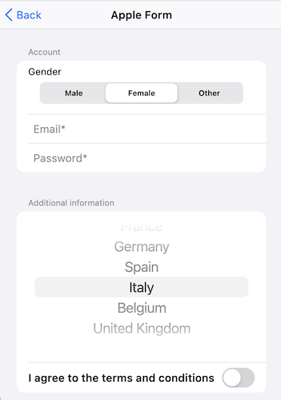
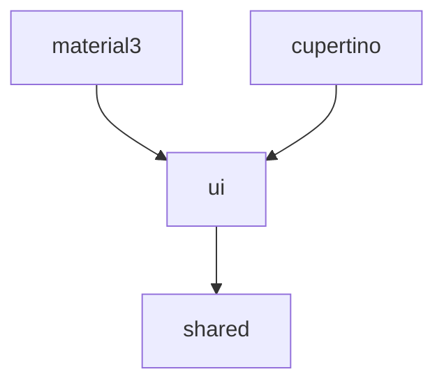

# jsonforms-kotlin

[](https://opensource.org/licenses/Apache-2.0)

`jsonforms-kotlin` is a Kotlin Multiplatform implementation of the [JSONForms](https://jsonforms.io/) 
standard from the Eclipse Foundation. It leverages the power of [Compose Multiplatform](https://www.jetbrains.com/lp/compose-multiplatform/) 
to render dynamic forms based on JSON Schemas and UI Schemas across various platforms, 
including Android, iOS, and the JVM.

**Key aspects:**

* **JSONForms Standard:** Adheres to the JSONForms specification, enabling declarative form definition and rendering.
* **Kotlin Multiplatform:** Built with Kotlin Multiplatform, ensuring code reusability and maintainability across different target platforms.
* **Compose Multiplatform:** Utilizes JetBrains' modern UI framework, Compose Multiplatform, for building native-like user interfaces on Android, iOS, and JVM.
* **Renderers:** Provides built-in renderers for popular design systems, including Material 3 and the Apple ecosystem (via Compose Cupertino).
* **Goal:** The primary goal of this library is to provide a flexible and platform-agnostic way to generate and manage forms within Kotlin Multiplatform applications, simplifying UI development for data entry and configuration.

## Usage

This section demonstrates basic usage of the `jsonforms-kotlin` library with examples showcasing 
the Material 3 and Cupertino renderers.

**Common Setup:**

Before using any renderer, you'll typically need to define your JSON Schema and UI Schema:

```kotlin
val schema = Schema(
    properties = persistentMapOf(
        "email" to StringProperty(
            pattern = "^[a-zA-Z0-9._%+-]+@[a-zA-Z0-9.-]+\\.[a-zA-Z]{2,}\$"
        ),
        "password" to StringProperty()
    ),
    required = persistentListOf("email", "password")
)
val uiSchema = VerticalLayout(
    elements = persistentListOf(
        Control(
            scope = "#/properties/email",
            label = "Email"
        ),
        Control(
            scope = "#/properties/password",
            label = "Password",
            options = ControlOptions(format = Format.Password)
        )
    )
)
```

**Using Material 3 Renderer**

To use the Material 3 renderer, ensure you have the corresponding dependency in your 
`build.gradle.kts` file (this will be detailed in the Download section later).

```kotlin
val state = rememberJsonFormState(initialValues = mutableMapOf())
JsonForm(
    schema = schema, // your schema
    uiSchema = uiSchema, // your ui schema
    state = state,
    layoutContent = { Material3Layout(content = it) },
    stringContent = { id ->
        val value = state[id].value as String?
        val error = state.error(id = id).value
        Material3StringProperty(
            value = value,
            error = error?.message,
            onValueChange = {
                state[id] = it
            }
        )
    },
    numberContent = { id ->
        val value = state[id].value as String?
        val error = state.error(id = id).value
        Material3NumberProperty(
            value = value,
            error = error?.message,
            onValueChange = {
                state[id] = it
            }
        )
    },
    booleanContent = { id ->
        val value = state[id].value as Boolean?
        Material3BooleanProperty(
            value = value,
            onValueChange = {
                state[id] = it
            }
        )
    }
)
```


**Using Cupertino Renderer**

To use the Cupertino renderer, ensure you have the corresponding dependency in your 
`build.gradle.kts` file (this will be detailed in the Download section later).

```kotlin
val state = rememberJsonFormState(initialValues = mutableMapOf())
JsonForm(
    schema = schema, // your schema
    uiSchema = uiSchema, // your uischema
    layoutContent = { CupertinoLayout(content = it) },
    stringContent = { id ->
        val value = state[id].value as String?
        val error = state.error(id = id).value
        CupertinoStringProperty(
            value = value,
            error = error?.message,
            onValueChange = {
                state[id] = it
            }
        )
    },
    numberContent = { id ->
        val value = state[id].value as String?
        val error = state.error(id = id).value
        CupertinoNumberProperty(
            value = value,
            error = error?.message,
            onValueChange = {
                state[id] = it
            }
        )
    },
    booleanContent = { id ->
        val value = state[id].value as Boolean?
        CupertinoBooleanProperty(
            value = value ?: false,
            onValueChange = {
                state[id] = it
            }
        )
    }
)
```



## Architecture



This diagram illustrates the modular architecture of `jsonforms-kotlin`:

* The `shared` module contains the core data models for JSON Schema, UI Schema, and the data handled by the forms.
* The `ui` module provides the foundational `JsonForm` composable and defines the Renderer interface. It depends on the `shared` module for the models but remains agnostic of any specific UI design system.
* The `material3` module implements a Renderer specifically for the [Material 3 design system](https://m3.material.io/). It depends on the `ui` module and provides Compose Multiplatform components that adhere to Material 3 guidelines.
* The `cupertino` module implements a Renderer for the Apple ecosystem, leveraging the [compose-cupertino library](https://github.com/schott12521/compose-cupertino). It also depends on the `ui` module and offers Cupertino-style Compose Multiplatform components.

## Download

The `jsonforms-kotlin` library is not yet available on Maven Central. However, it will be published there in the future.

Once available, you will be able to include it in your `build.gradle.kts` file like this:

```kotlin
// In your shared, Android, iOS, or JVM module's build.gradle.kts
dependencies {
    implementation("com.paligot.jsonforms.kotlin:core:VERSION")
    implementation("com.paligot.jsonforms.kotlin:ui:VERSION")
    implementation("com.paligot.jsonforms.kotlin:material3:VERSION")
    implementation("com.paligot.jsonforms.kotlin:cupertino:VERSION")
}
```

## License

```
Copyright 2025 Gérard Paligot.

Licensed under the Apache License, Version 2.0 (the "License");
you may not use this file except in compliance with the License.
You may obtain a copy of the License at

http://www.apache.org/licenses/LICENSE-2.0

Unless required by applicable law or agreed to in writing, software
distributed under the License is distributed on an "AS IS" BASIS,
WITHOUT WARRANTIES OR CONDITIONS OF ANY KIND, either express or implied.
See the License for the specific language governing permissions and
limitations under the License.
```
